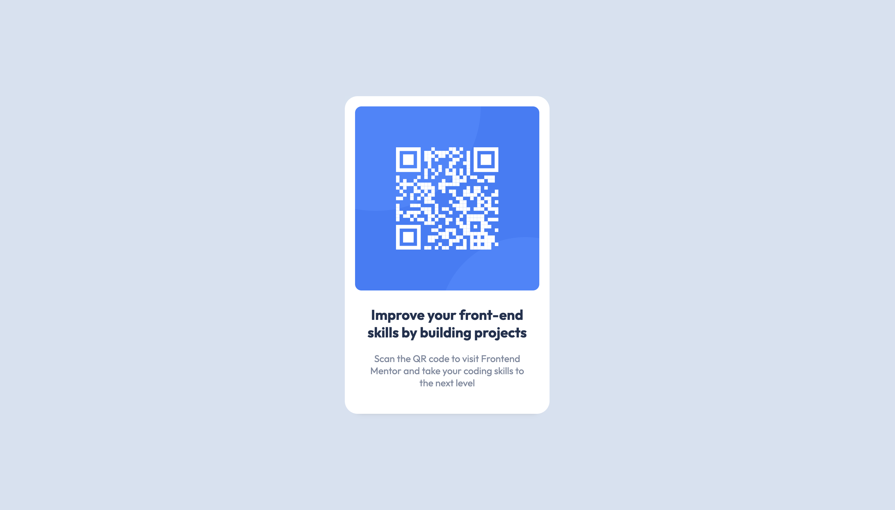

# Frontend Mentor - QR code component solution

This is a solution to the [QR code component challenge on Frontend Mentor](https://www.frontendmentor.io/challenges/qr-code-component-iux_sIO_H). Frontend Mentor challenges help you improve your coding skills by building realistic projects.

## Table of contents

- [Overview](#overview)
  - [Screenshot](#screenshot)
  - [Links](#links)
- [My process](#my-process)
  - [Built with](#built-with)
  - [What I learned](#what-i-learned)
- [Author](#author)
- [Acknowledgments](#acknowledgments)

**Note: Delete this note and update the table of contents based on what sections you keep.**

## Overview

### Screenshot

Desktop View

### Links

- Solution URL: [Frontend Mentor Solution](https://www.frontendmentor.io/solutions/good-old-fashion-html-and-css-Q-fmAA_bJ)
- Live Site URL: [GitHut Page](https://colinmcarthur85.github.io/QR_Code_Component/)

## My process

### Built with

- Semantic HTML5 markup
- CSS custom properties
- Flexbox
- Mobile-first workflow

### What I learned

- Most of the education came from leaning about GitHub. I have a few small projects that Ive uploaded to GitHub before but I didn't fully understand what I was doing. After uploading this project I noticed that I needed to make a few amendments to get it to look more like the design that was given to me so I needed learn about Commiting and Pushing updates to this repository.
- One interesting thing I learned was that when referencing a CSS file withing VSCode, you can place a / in front of the URL and Live Server still seems to reference the file correctly. However, when you commit and push that to GitHub it acutally breaks the link and the HTML will have no styling.
- Otherwise, this was straightforward

## Author

- Frontend Mentor - [Colin McArthur](https://www.frontendmentor.io/profile/ColinMcArthur85)
- Instagram - [@colin.c.mcarthur](https://www.instagram.com/colin.c.mcarthur/)
